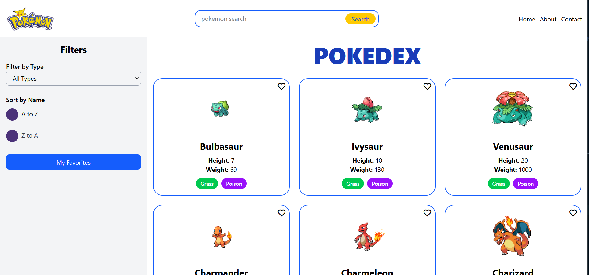
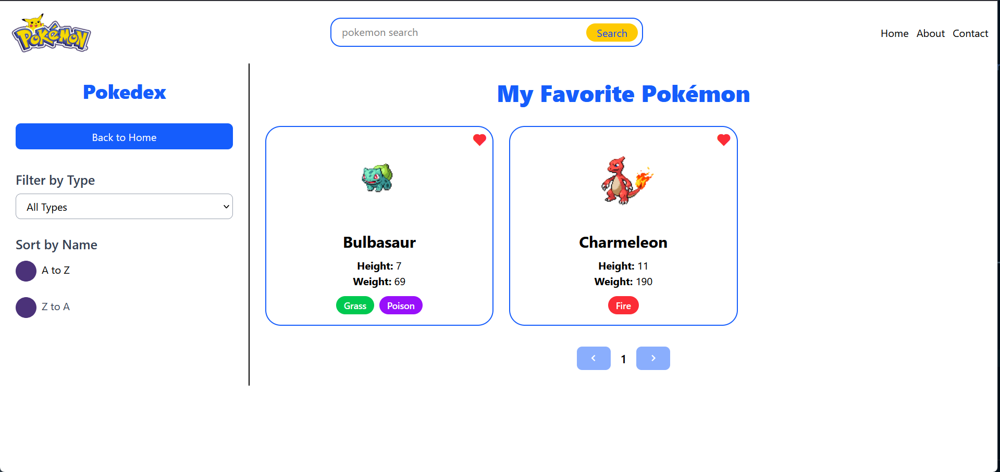
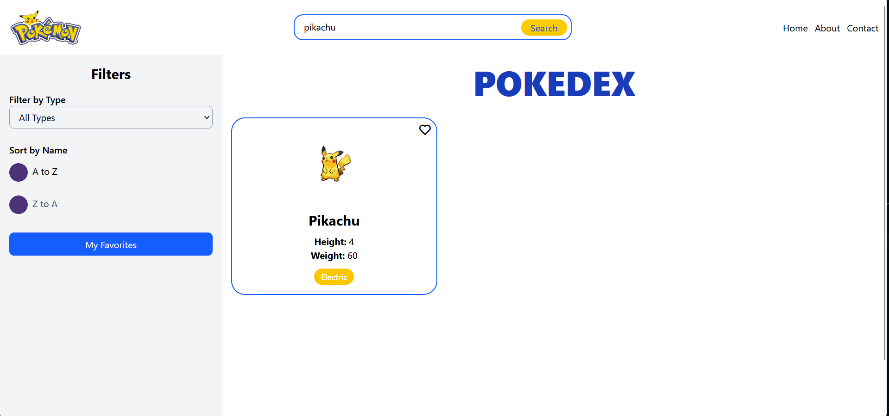
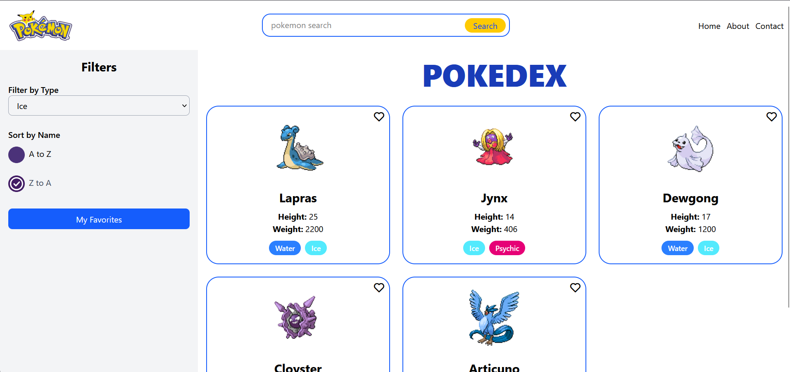

# Real-Time Pokémon Search App

A real-time Pokémon search application built with React and the Pokémon API (PokeAPI). This app allows users to search for Pokémon, view their details like height, weight, types, and images. It also includes a caching mechanism using `localStorage` for better performance on repeat searches.

## Features

- **Search**: Type in the search bar to find Pokémon by name.
- **Debounced Search**: The search is debounced to reduce API calls while typing.
- **Caching**: Pokémon data is fetched and stored in `localStorage` to avoid redundant API calls on subsequent visits.
- **Responsive Design**: The layout adjusts for different screen sizes.

## Technologies Used

- **React**: Frontend library for building user interfaces.
- **TailwindCSS**: Utility-first CSS framework for styling the components.
- **PokeAPI**: API to fetch Pokémon data.

## 🖼️ Screenshots

